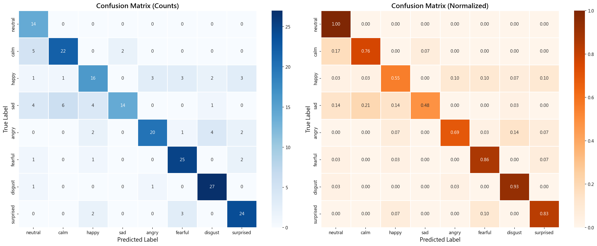
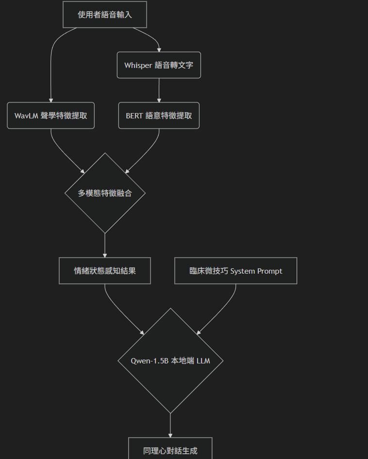

# AI Psychological Companion with Edge Inference & Multimodal Emotion Recognition
> 基於邊緣推論與多模態感知之 AI 心理陪伴系統 (阿光)

## 📖 專案概述 (Project Overview)
阿光是一套完全在本地端（Edge Device）執行的雙模態 AI 心理輔導系統。

當初開發的動機，是因為在測試時發現：傳統 LLM 根本聽不懂人類的「語氣」，而且非常容易對使用者「說教」。為了解決這些痛點，我用 3,500 多行程式碼從頭刻出了這套系統，主要包含兩個模組：
1. **感知前端 (Perception)**：我獨立開發的 WavLM 多模態語音情緒辨識系統 (SER)。
2. **決策後端 (Decision)**：團隊合作開發的 Qwen-1.5B 邊緣推論大腦，裡面整合了 FSM 狀態機與心理學微技巧。

---

##  核心工程亮點 (Core Engineering Highlights)

### 1. 多模態語音情緒感知 (SER) 與 Late Fusion (晚期融合)
* **核心挑戰**：在訓練初期遭遇嚴重的過度擬合。深入分析後發現，由於 RAVDESS 資料集 (1,440 筆) 為演員唸固定台詞，導致文字模態完全缺乏情緒特徵，純語意準確率僅有慘烈的 6.45%，成為干擾決策的「雜訊」。
* **工程突破 (消融實驗)**：為了打破單模態極限，我放棄了容易 OOM 的 Early Fusion，改採 **Late Fusion (晚期融合)**。我撰寫腳本進行 Grid Search 網格搜索，發現將 WavLM (聲學) 與 Whisper/BERT (語意) 的預測權重極端化調整至 **0.95 : 0.05** 時，能有效避開文字雜訊干擾。
* **實測結果**：成功將整體驗證準確率拉高到 **81.9%** (F1-Score 0.7417)，在有環境雜訊的情況下，聲學模型依然能維持高度穩定。

* 

### 2. 邊緣運算極限壓縮 (Edge LLM Quantization)
* **工程做法**：醫療資料絕對不能上雲端，所以我們挑戰在入門級的顯卡 (NVIDIA GTX 1660 6GB) 上跑 Qwen-1.5B。我用 `bitsandbytes` 掛了 **4-bit NF4 量化**，再加上 PEFT (LoRA) 微調。
* **實測結果**：成功把 VRAM 佔用壓到 **4GB 以內**，推論速度非常順暢，完全實現 100% 離線運算。

### 3. FSM 對話狀態機與動態心理路由
* **工程做法**：為了防止開放式 LLM 亂聊偏題甚至鬼打牆，我直接寫了一套 FSM 控制流。
  * `classify_dialogue_stage()` 會把對話強制鎖在 4 個階段：破冰 ➔ 評估 ➔ 陪伴 ➔ 收尾。
  * `classify_psychology_route()` 則會看使用者的狀況，動態切換 SFBT(焦點解決) 或 EFT(情緒取向) 等流派的 System Prompt。

### 4. 雙軌 RAG 記憶檢索與幻覺控制
* **工程做法**：我用 `ChromaDB` 架了向量資料庫，並且用 ThreadPoolExecutor 跑並行檢索。
  * **過濾廢話**：`extract_user_facts()` 會先判斷並抽出客觀事實再存檔，不會把使用者的語氣詞也塞進資料庫。
  * **專業知識**：遇到高風險關鍵字時，`retrieve_pdf_knowledge()` 會自動去撈背後掛載的《精神科學教科書》。
* **解決幻覺**：為了徹底消滅 LLM 的「說教病」，我寫了 `check_emotion_consistency()` 來確保 AI 產出的文字跟前端 SER 聽到的情緒沒有衝突。最後把 Temperature 鎖在 0.2，實測說教率降到 0%。

### 5. 全端系統工程：Mood-Aware UI 與 PDF 報告
* **動態 UI**：介面是用 Streamlit 刻的，最特別的是背景顏色跟 CSS 動畫會看使用者現在是「平靜、低落還是焦慮」來動態變換，甚至還有內建互動式的呼吸練習 (`L1226`)。
* **臨床報告**：我調用 `reportlab` 寫了 `generate_pdf_report()`，系統聊完天會自動畫出情緒圓餅圖跟分數趨勢圖，同時產生給「使用者看」跟「醫師看」的兩種 PDF 報告。

---

##  系統架構 (System Architecture)

---

##  技術棧 (Tech Stack)
* **後端與深度學習**: PyTorch, HuggingFace Transformers, ChromaDB
* **聲學與語音處理**: WavLM, Whisper, Edge TTS
* **模型量化與微調**: bitsandbytes (4-bit NF4), PEFT (LoRA)
* **前端與資料視覺化**: Streamlit, ReportLab, Pandas

---

##  學術聲明與版權 (Academic Integrity & License)
為了符合學術倫理與開源規範，本專案聲明如下：
1. **專案分工**：
   * **決策後端與系統介面 (阿光系統)**：為團隊合作開發之專案，包含基礎 LLM 串接、RAG 架構與 UI 介面實作。
   * **感知前端 (SER)**：為**本人獨立研究與開發**之模組，包含 WavLM 聲學特徵萃取、Data Blending 資料融合演算法、以及模型量化最佳化。
2. **資料集規範**：本專案使用之 RAVDESS、GoEmotions 等資料集僅供學術研究使用。為遵守原作者授權條款，本 Repository **不包含**原始音檔與文本資料，僅開源模型架構與資料處理腳本。
3. **隱私宣告**：本程式碼已移除所有與伺服器或個人帳號相關之環境變數與 API Keys。

